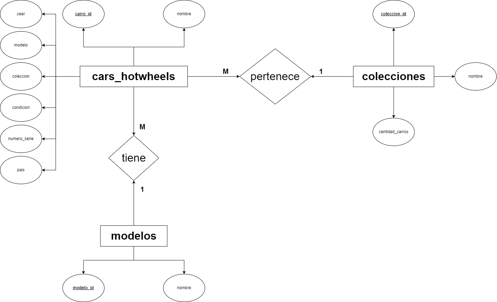
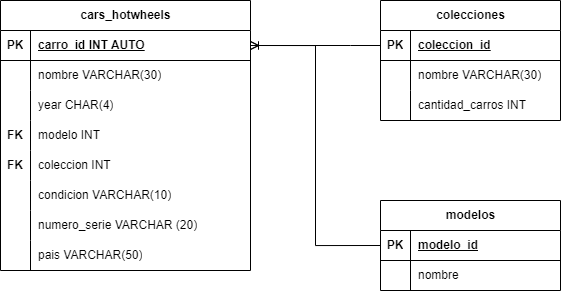

# hot_wheels_bd_2023

# Carros hotwheels (Modelado)

## Listados de Entidades

### cars_hotwheels

- carro_id **(PK)**
- marca
- year
- numero_serie **(UQ)**
- condicion
- modelo **(FK)**
- coleccion **(FK)**
- pais

### colecciones **(EC)**

- coleccion_id **(PK)**
- nombre
- cantidad_carros

### modelos **(EC)**

- modelo_id **(PK)**
- nombre

## Relaciones

1. Muchos _carro_ pertenece a una _coleccion_.
2. Una _coleccion_ contiene muchos _carros_.
3. Un _carro_ tiene un _modelo_.
4. Un _modelo_ puede tener varios _carros_.

## Diagramas

### Modelo Entidad - Relación

### Modelo Relacional de la BD

## Reglas de Negocio

### Carros hot wheels

1. Un carro Hot Wheels debe tener un nombre de modelo y un año de fabricación obligatorios.
2. Un carro Hot Wheels puede estar en una sola colección a la vez (relación "uno a uno" con la entidad "Colección").
3. Cada carro Hot Wheels debe tener un número de serie único, si corresponde.
4. Crear los registros  de una carro
5. Actualizar los datos de un(os) carro(s) en particular, dada una condicion en particular
6. Leer el registro de un(os) carro(s) en particular, dada una condicion en particular.
7. Leer todos los registros de la entidad carros.
8. Eliminar los datos de un carro dada una condicion en particular.

### Coleccion

1. El nombre de la colección es obligatorio y debe ser único para cada colección.
2. La cantidad de carros en la colección no puede ser negativa.
3. Crear los registros  de una carro
4. Actualizar los datos de una(s) coleccion(es) en particular, dada una condicion en particular
5. Leer el registro de una(s) coleccion(es) en particular, dada una condicion en particular.
6. Leer todos los registros de la entidad coleccion.
7. Eliminar los datos de un coleccion dada una condicion en particular.

### Modelo

1. Crear los registros  de un modelo
2. Actualizar los datos de un(os) modelo(s) en particular, dada una condicion en particular
3. Leer el registro de un(os) modelo(s) en particular, dada una condicion en particular.
4. Leer todos los registros de la entidad modelo.
5. Eliminar los datos de un modelo dada una condicion en particular.
